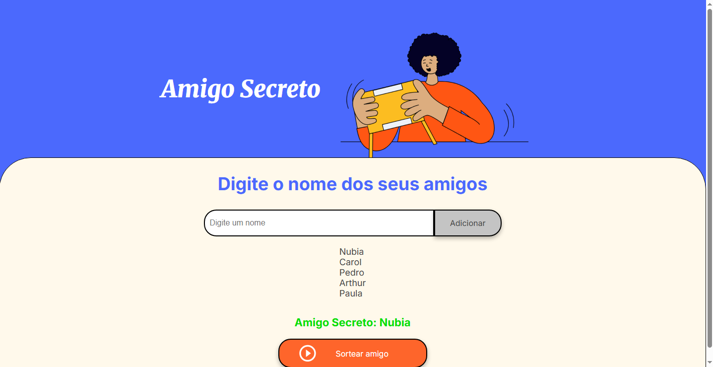

# 🎁 Amigo Secreto

Bem-vindo ao **Amigo Secreto**, um projeto interativo e divertido que permite sortear um amigo secreto de forma aleatória!

> Este projeto foi desenvolvido como trabalho no curso **ONE (Oracle Next Education)** em conjunto com a **Alura**.

## 🚀 Tecnologias Utilizadas

Este projeto foi desenvolvido utilizando as seguintes tecnologias:

- 
- 
- 


## 🕹️ Como Jogar

1. Insira o nome de um amigo no campo de entrada.
2. Clique no botão **Adicionar** para incluir o nome na lista.
3. Visualize os nomes adicionados na lista exibida na página.
4. Quando terminar de adicionar os nomes, clique no botão **Sortear Amigo** para realizar o sorteio.
5. O nome do amigo secreto será exibido na tela.

## 📸 Captura de Tela



## 🔧 Como Executar o Projeto

1. Clone este repositório:
   ```bash
   git clone https://github.com/janainasmalves/amigo-secreto.git
## 🔍 Desafios e Aprendizados
- **Quais foram os desafios que eu encontrei**
Manipulação do DOM: Integrar a lógica de manipulação do DOM com a validação de entradas.
Gerenciamento de Estados: Manter a consistência dos dados no array de amigos e atualizar a interface de forma dinâmica.
Organização do Código: Estruturar as funções de forma modular e garantir que as funcionalidades não se sobreponham.
- **Como superei esses desafios**
Pesquisa e Prática: Busquei referências e tutoriais sobre manipulação do DOM em JavaScript e a utilização de arrays para gerenciar estados.
Refatoração do Código: Dividi as funcionalidades em funções separadas (adicionarAmigo, atualizarLista, sortearAmigo) para facilitar a manutenção e o entendimento.
Testes Contínuos: Utilize o console do navegador para depurar e verificar o fluxo do código, garantindo que cada parte funcionasse conforme o esperado.
- **Quais implementações que achei mais interessantes**
Sorteio Aleatório: A utilização de Math.random() para sortear de forma justa e aleatória um amigo da lista.
Atualização Dinâmica da Interface: A maneira como o DOM é manipulado para refletir as mudanças no array de amigos em tempo real.
Validação de Entrada: A implementação da verificação para evitar nomes vazios, garantindo que o usuário insira dados válidos antes de prosseguir com o sorteio.
## 🛠️ Melhorias Futuras
 Adicionar a funcionalidade de remover nomes da lista.
 Implementar a verificação para evitar nomes duplicados.
 Melhorar a responsividade e o design da aplicação.
 Incluir animações para tornar o sorteio mais interativo.

 Feito com ❤️ janainasmalves!
